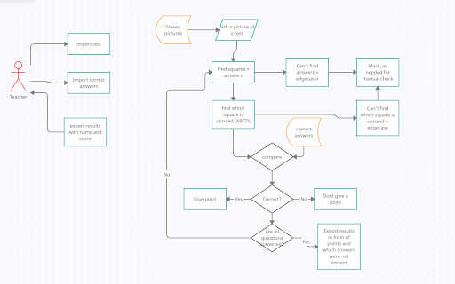

# kontrola_testov
<html>
<body>

<h1>School project: marking tests automatically</h1>

Kontrolovanie a hodnotenie testov, ktore budu vlozene ako obrazky

<h2>Zadefinovanie problemu:</h2>

Problemom je opravovanie velkej kvantity pisomiek za kratky casovy usek a s minimalnou chybovostou. Ucitelia su casto zatazeny do miery v ktorej je pre nich opravovanie pisomiek, casovo narocna aktivita, posledna priorita. Nas program by  mal ulahcit casovu naloz. Manualne opravovanie je taktiez financna zataz, kedze zamestnavatel musi platit osobu za korekciu uz napisanych testov. Dalsim problemom je ludska chyba ktora sa exponencialne znasobuje pri vacsej kvantite pisomiek. Taktiez by opravovani velkych kvantit moze vzniknut chaos a niektore testy sa mozu stratit, ak ich opravuje viacero ludi na viacerych miestach, ako napriklad u seba doma. 
Problemy je mozne riesit bez programu napriklad manualne treba pozriet kazdy test a skontrolovat spravne odpovede. Pre vacsiu efektivitu by bolo najlepsie aby to robilo viacero ludi, v niektorych pripadoch by preto bolo najlepsie najat pomoc externych ludi, ktroych spolahlivost sa vsak neda zarucit. Aby sme eliminovali co najviac ľudských chýb bolo by najlepsie ak by uz opravene testy niekto kontroloval, co je tiez casova a financna zataz.

<h2>Strucny opis riesenia:</h2>

Software by problemy uvedene vyssie riesil automatizaciou na zaklade oskenovania testu a nasledneho porovnania skenu s vopred zadanym klucom. Vdaka tomuto by sme eliminovali ludsku chybu a cas potrebny na opravu by bol zredukovany na cas skenovania. Vdaka tomuto nie je potreba viacero ucitelov. Pomocou tohto sme z aktivneho procesu spravili opravovanie testov pasivnym procesom. Pri spravne zadefinovanej databaze sa taktiez eliminuje problem straty testov alebo chybnej opravy.
Najvacsie obmedzenie softveru bude prave nacitavanie testov do softveru. Pri velkej kvantite testov ide o vela dat, ak mame niekolko tisic fotiek testov, idealne v co najlepsej kvalite aby softver dokazal spravne rozoznat odpovede a aj ich spravne vyhodnotit. S tymto vsak prichadza problem velkosti suborov, ktory ked je prilis velky  tak proces bude trvat dlhsie, lebo trva kym sa tieto data prenesu z bodu a kde boli spracovane do elektronickej formy bodu b ako napriklad telefon alebo skener. Taktiez bude trvat nejaky cas kym sa vsetky testy spravia v elektronickej forme to znamena ze nejaky clovek ich musi vsetky naskenovat. Taktiez softver moze urobit chybu, napriklad ak je nejaky test nespravne zaznaceny alebo na fotke sa neda s istotou rozoznat spravna odpoved. V takychto pripadoch by bolo treba manualne clovekom skontrolovat test. Problem sa vsak naskytne ked softver oznaci nespravnu odpoved bez toho aby oznacil, ze test treba manulane skontrolovat.
 
Najvacsim rizikom softwaru je nepriazniva znamka v pripade zleho oskenovania testu, kde by ziak dostal percentil nezodpovedajucim jeho odpovediam. Riesenim by bolo problematicke testy oznacit ako pochybne, a odlozit na manualnu kontrolu.

<h2>Rozdelenie riešenia na samostatné časti:</h2>

Zistit kde su zapisane odpovede. Na naskenovanom papiery rozoznat kde sa nachadzaju stvorceky na spravne odpovede v ABCD formate. Taktiez treba priradit spravne stvorceky k spravnej otazke, rozumej otazka 4 musi mat priradene odpoved 4, aby nenastala situacia kde by odpoved boli oznacene ako ina otazka a tak sa drasticky zmenil vysledok. 
Zadat spravne riesenie. Ucitile alebo osoba zodpovedajuca za opravu testov musi mat moznost zadat spravne odpovede aby softver mal s cim porovna odpovede studentov. Tato moznost by bola robena priamo v softvere, nebola by zadavana ako test na paperi. Tiez by sa dala vytvorit databaza spravnych odpovedi, ak by sa testy pouzivali viackrat. 
Zistit napisanu opdpoved. Program najde na oskenovanom teste otazku a priradi si k nej zaskrtany stvorcek patriaci otazke. Ak nieje zaskrtany ziadny stvorcek alebo nie je jasne ktora odpoved bola zvolena, program flagne odpoved a posunie sa dalej. Tieto odpovede zostavaju na manualnu kontrolu.  
Porovnat napisanu odpoved so spravnou odpovedou. Softver musi porovnat odpoved ktoru oznacili ako spravnu s predtym nahranim spravnym riesenim. Musi porovnat spravnu otazku so spravnou v zmysle musi porovnat odpoved 4 so spravnou odpovedou 4 a nie 5. Softver tiez musi vyhodnotit ci je odpoved spravna alebo nespravna. 
Priradit vysledok k menu a zratat percentil spravnych odpovedi. Po okontrolovani celeho testu program priradi pocet spravnych odpovedi k menu ziaka. Nasledne zrata vyslednu znamku vydelnim spravnych odpovedi s celkovym poctom otazok. Taktiez by porgram mal potom exportovat vysledky s menom do excel tabulky v prehladnom formate.

<h2>Podrobná špecifikácia: </h2>

<b>Nacitat databazu odpovedi</b> 
1. Naskenovanie testov 
2. Ulozenie testov do jedneho folderu, ku ktoremu viem mat pristup 
3. Importovat testy do softveru 
4. Postupne otvarat testy 
<b>Kontrola odpovedi</b> 
1. Otvorit dokument 
2. Najst stovrceky s odpovedami 
3. Najst spravnu odpoved 
4. Priradit odpoved k otazke 
5. Porovnat odpovede 
<b>Zapisopvanie vysledkov</b> 
1. Zisit ci je odpoved spravna lebo nie 
2. Ak ano +bod ak nie tak nic 
3. Priradit vsetky odpovede k menu 
4. Vypisat meno s odpovedami 
5. Exportovat meno s opdovedami  
Uzivatel moze vykonat niekolko akcii. Prvou z nich je nahranie odpovedi v textovom formate. Nasledne moze zadat naskenovane fotky testov. Potom moze uzivatel zvolit opravu testov, vtedy program prejde zadane testy a porovna ich s klucom. A posledna moznost je zobrazit vysledky, ked program vysledky priradi k menu. 
Pristup by mal ucital a admin. Ziaci by nemali pristup, lebo by vzniklo vela problemov s unikom osobnych udajov alebo zmenou spravnych odpovedi. 
Ked softver ma testy a nema odpovede, nevie precitat fotku, nema meno priradene k testu, ma odpovede a nema testy  

  
<h2>Zoznam technologii</h2>

Python, mozno C/C++ 
Musime si sami vytvorit library, alebo mozme najst nejake vyplnene testy na internete, ktore stiahneme a pouzijeme 
Na samotne rozoznavanie obrazkov by sme mali pouzit open cv, pretoze je dostupny, spolahlivy a v pythone  
<b>Useful links:</b> 
https://stackabuse.com/image-recognition-in-python-with-tensorflow-and-keras/ 
https://github.com/dostuffthatmatters/IN8011-HW-AutoCorrection 
https://opencv.org/  
https://docs.opencv.org/4.x/df/d0d/tutorial_find_contours.html 
https://docs.opencv.org/4.x/d4/d7d/tutorial_harris_detector.html 
https://docs.opencv.org/4.x/d7/dff/tutorial_feature_homography.html

<h2>Vytvorenie milestonov</h2>

Imporotvat fotku do kodu 
Zistit co je na fotje - najst okienka s odpovedou - pracujeme iba s jednou odpovedou 
Zistit ktore policko je zaskrtnute 
Zadat spravne odpovede + porovnat odpoved so spravnou odpovedou
Praca s viac ako jednym polickom 
Exportovat vysledky - excel? 
Meno na teste - rozoznat a priradit k testu 
GUI?

<i>Ulohou tohto programu je zjednodusit opravovanie testov ucitelom pomocou rozoznavania odpovedi vo fotkach. Vdaka tomuto by sme mali znizit chybovost a casovu narocnost tejto procedury. Pretoze na fungovanie programu nie je prioritou pekne GUI alebo GUI celkovo, je to na konci nasho priority listu. Dokym nebude program vo funkcnom a pouzivatelnom stadiu sme spokojny s pouzivatelom komunikujucim iba cez terminal. 
V hotovom produkte by pouzivatel zadal fotky alebo scany testov na opravenie spolu s klucom. Testy mozu byt len vo vopred stanovenom formate s uzatvorenymi otazakmi. Program vie vo fotke idntifikovat meno studenta a odpovede priradene k otazkam. Programu by toto mohlo byt ulahcne pomocou qr kodu.</i>

</body>
</html>

